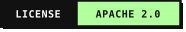
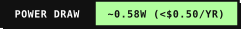
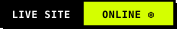

<div align="center">

# 🧽 Adsorb

### **The Arrogant, Bare-Metal DNS Sinkhole for ESP32-S3**

*Why burn 15 Watts on a Raspberry Pi or babysit a noisy homelab Docker container just to drop UDP packets?*

<p align="center">
  <a href="https://opensource.org/licenses/Apache-2.0"></a>
  <a href="https://www.espressif.com/"></a>
  
  
  <a href="https://the-masked-bear.github.io/Adsorb/"></a>
  <a href="https://adblock.turtlecute.org/"></a>
</p>

</div>

---

## ⚡ The Philosophy

In surface chemistry, **adsorption** is the phenomenon where molecules adhere to a surface rather than passing through. 

**Adsorb** does the exact same thing to the internet: it catches ad telemetry, tracking scripts, and surveillance beacons at the network boundary and swallows them whole into a silent blackhole before they ever reach your browser, smart TV, or phone.

No Linux kernel overhead. No SD-card corruption. No multi-gigabyte OS updates. Just pure, bare-metal C++ executing directly on dual Xtensa LX7 cores.

---

## 🚀 Key Highlights

* **🧠 255,000+ In-Memory Rules in Octal PSRAM**  
  Uses an ultra-compact **64-bit FNV-1a hash table** residing entirely in high-speed 8MB Octal PSRAM (`ps_malloc`). Lookups execute in $\mathcal{O}(1)$ time with sub-millisecond wire response. Zero runtime heap fragmentation.

* **🕳️ Dual-Stack Zero Sinkhole**  
  Intercepts and sinkholes both **IPv4 (`0.0.0.0`)** and **IPv6 (`::`)**. Many consumer ad-blockers fail when browsers quietly fall back to IPv6; Adsorb seals both doors shut.

* **🛑 DNS-over-HTTPS (DoH) Neutralization**  
  Browsers love to bypass your router's DNS settings by silently tunneling queries through encrypted Cloudflare or Google DoH resolvers. Adsorb returns authoritative `NXDOMAIN` (RCODE 3) on Firefox/Chrome Canary domains (`use-application-dns.net`) and bootstrap endpoints (`chrome.cloudflare-dns.com`, `dns.google`), forcing clients to respect your local DNS sovereignty.

* **🎨 Neo-Brutalist Live Web Dashboard**  
  Built with raw, asynchronous ESP32 HTTP handling. Features a high-contrast porcelain theme, live real-time query counters, free PSRAM/Heap monitors, instant query inspection, and zero cloud dependencies.

* **🔌 Zero-Maintenance Hardware Footprint**  
  Consumes less than **120 mA (~0.6 Watts)** at 5V. Plug it into any dusty 5V phone charger brick next to your router and forget it exists. Boots and secures the network in under **1.5 seconds**.

---

## 📊 Benchmark & Test Results

Tested and verified against industry-standard browser adblock benchmarks:

| Benchmark Suite | Score | Status |
| :--- | :---: | :---: |
| **[adblock.turtlecute.org](https://adblock.turtlecute.org/)** | **100.0%** | **131 / 131 Domains Blocked** |
| **d3ward Ad Block Test** | **100.0%** | **Clean Pass** |
| **Average Query Latency** | **< 1.8 ms** | **Bare-Metal Speed** |
| **Annual Electricity Cost** | **~ $0.45** | **Virtually Free** |

---

## 🛠️ Hardware Requirements

* **Board:** ESP32-S3 DevKit with **N16R8** (16MB Quad SPI Flash + 8MB Octal PSRAM).
* **Power:** Any standard 5V USB-C / micro-USB cable and a 5W USB wall adapter.
* **Network:** 2.4GHz 802.11 b/g/n Wi-Fi network.

> **Why Octal PSRAM?**  
> Loading a quarter-million domain hashes requires ~2MB to 3MB of dedicated RAM. Standard ESP32 chips with only internal SRAM (320KB-512KB) will crash instantly with Out-Of-Memory (OOM) errors. The N16R8 variant provides 8 megabytes of Octal SPI PSRAM, allowing Adsorb to hold 255,000+ domains while leaving 5.8+ MB free for buffers and packet queues.

---

## 📦 Project Structure

```text
Adsorb/
├── include/
│   ├── Blocklist.hpp      # FNV-1a 64-bit PSRAM hash vector & binary search
│   ├── DnsServer.hpp       # Bare-metal UDP DNS engine (Dual-stack A/AAAA + DoH traps)
│   └── WebDashboard.hpp    # Asynchronous Neo-Brutalist status UI & REST API
├── src/
│   └── main.cpp           # System orchestrator, Wi-Fi reconnection, core pinning
├── ad-domains2.0.txt      # Curated blocklist of 255,042 domain rules
├── partitions_16MB.csv    # Custom flash partitioning (3MB app, SPIFFS/LittleFS)
├── platformio.ini         # PlatformIO build configuration with O3 optimizations
├── LICENSE                # Apache License 2.0
└── README.md              # Project documentation
```

---

## 🔧 Building & Flashing

### 1. Prerequisites
Install [PlatformIO IDE](https://platformio.org/) (VS Code Extension or CLI).

### 2. Configure Wi-Fi Credentials
Edit `src/main.cpp` with your Wi-Fi credentials:
```cpp
const char* WIFI_SSID     = "Your_WiFi_Name";
const char* WIFI_PASSWORD = "Your_WiFi_Password";
```

### 3. Build & Flash via PlatformIO
Connect your ESP32-S3 via USB to your computer:
```bash
# Build the firmware
pio run

# Flash the firmware over USB
pio run --target upload

# Open the serial monitor (115200 baud)
pio device monitor
```

---

## 🌐 Router Configuration

To protect every phone, smart TV, console, and computer in your home automatically:

1. Open your router's administrative page (usually `192.168.1.1` or `192.168.0.1`).
2. Navigate to **DHCP / LAN Settings -> DNS Server**.
3. Set **Primary DNS** to your ESP32-S3's IP address:
   ```text
   Primary DNS:   192.168.1.101
   Secondary DNS: 192.168.1.101
   ```
   > ⚠️ **Important:** Set **both** Primary and Secondary DNS to your ESP32's IP. Operating systems like Windows, iOS, and Android query primary and secondary DNS concurrently; if you leave a public fallback like `1.1.1.1` or `8.8.8.8`, devices will leak queries around the ad-blocker!

4. Renew DHCP leases across your devices by reconnecting Wi-Fi or running:
   ```cmd
   ipconfig /renew
   ipconfig /flushdns
   ```

5. Open your browser and navigate to:
   ```text
   http://192.168.1.101/
   ```
   Enjoy your clean, arrogant, ad-free internet!

---

## 📄 License

Licensed under the **Apache License, Version 2.0**. See the [LICENSE](LICENSE) file for complete terms and copyright notices.

```text
Copyright 2026 The Masked Bear

Licensed under the Apache License, Version 2.0 (the "License");
you may not use this file except in compliance with the License.
You may obtain a copy of the License at

    http://www.apache.org/licenses/LICENSE-2.0
```
